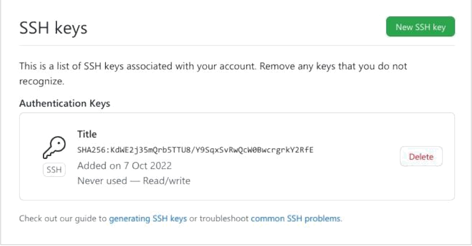
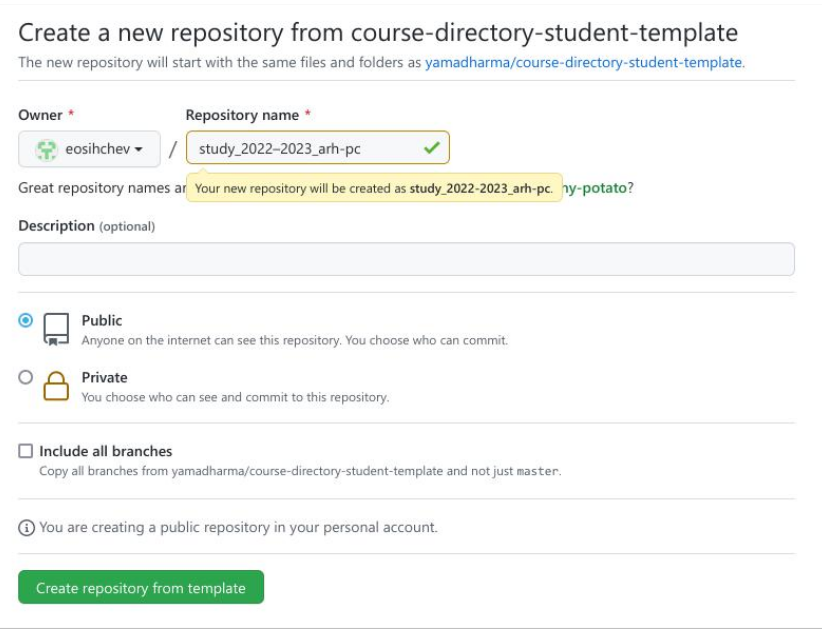

---
## Front matter
title: "Отчёт по лабораторной работе №3"
subtitle: "дисциплина: Архитектура компьютера"
author: "Сычев Егор Олегович"

## Generic otions
lang: ru-RU
toc-title: "Содержание"

## Bibliography
bibliography: bib/cite.bib
csl: pandoc/csl/gost-r-7-0-5-2008-numeric.csl

## Pdf output format
toc: true # Table of contents
toc-depth: 2
lof: true # List of figures
lot: true # List of tables
fontsize: 12pt
linestretch: 1.5
papersize: a4
documentclass: scrreprt
## I18n polyglossia
polyglossia-lang:
  name: russian
  options:
	- spelling=modern
	- babelshorthands=true
polyglossia-otherlangs:
  name: english
## I18n babel
babel-lang: russian
babel-otherlangs: english
## Fonts
mainfont: PT Serif
romanfont: PT Serif
sansfont: PT Sans
monofont: PT Mono
mainfontoptions: Ligatures=TeX
romanfontoptions: Ligatures=TeX
sansfontoptions: Ligatures=TeX,Scale=MatchLowercase
monofontoptions: Scale=MatchLowercase,Scale=0.9
## Biblatex
biblatex: true
biblio-style: "gost-numeric"
biblatexoptions:
  - parentracker=true
  - backend=biber
  - hyperref=auto
  - language=auto
  - autolang=other*
  - citestyle=gost-numeric
## Pandoc-crossref LaTeX customization
figureTitle: "Рис."
tableTitle: "Таблица"
listingTitle: "Листинг"
lofTitle: "Список иллюстраций"
lotTitle: "Список таблиц"
lolTitle: "Листинги"
## Misc options
indent: true
header-includes:
  - \usepackage{indentfirst}
  - \usepackage{float} # keep figures where there are in the text
  - \floatplacement{figure}{H} # keep figures where there are in the text
---

# Цель работы

Изучить идеалогию и применение средств контроля версий. Приобрести практические навыки по работе с системой git.

# Выполнение лабораторной работы

1. Создаем учетную запись github.

2. Проводим базовую настройку git.

3. Создаем SSH ключ.

4. Копируем SSH ключ в буфер обмена.

5. Вставляем ключ на сайте.

6. Создаем каталог для предмета «Архитектура компью-тера».

7. Переходим на страницу репозитория с шаблоном курса, выбираем use this template, задаем имя репозитория и создаем его.

8. Переходим в каталог курса и клонируем созданный репозиторий.

9. Переходим в каталог курса, удаляем лишние файлы, создаем необходимые каталоги.

10. Отправляем файлы на сервер.

11. Проверяем правильность создания иерархии рабочего пространства в локальном репозитории и на странице github.

# Самостоятельная работа

1. Скопируем предыдущие отчеты по лабораторным работам в нужные каталоги.

2. Загрузим отчеты на github, при помощи команд git add, git commit и git push.

3. Проверим правильность выполненных действий.

# Выводы

Я изучил идеалогию и применене средств контроля версий. В том числе приобрел практические навыки по работе с системой git.
