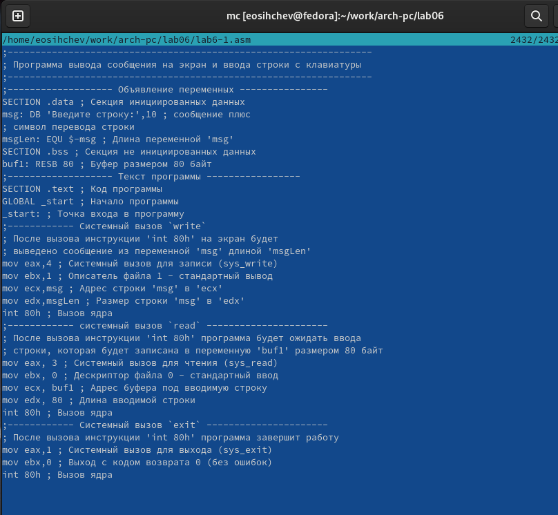

---
## Front matter
title: "Отчёт по лабораторной работе №6"
subtitle: "дисциплина: Архитектура компьютера"
author: "Сычев Егор Олегович"

## Generic otions
lang: ru-RU
toc-title: "Содержание"

## Bibliography
bibliography: bib/cite.bib
csl: pandoc/csl/gost-r-7-0-5-2008-numeric.csl

## Pdf output format
toc: true # Table of contents
toc-depth: 2
lof: true # List of figures
lot: true # List of tables
fontsize: 12pt
linestretch: 1.5
papersize: a4
documentclass: scrreprt
## I18n polyglossia
polyglossia-lang:
  name: russian
  options:
	- spelling=modern
	- babelshorthands=true
polyglossia-otherlangs:
  name: english
## I18n babel
babel-lang: russian
babel-otherlangs: english
## Fonts
mainfont: PT Serif
romanfont: PT Serif
sansfont: PT Sans
monofont: PT Mono
mainfontoptions: Ligatures=TeX
romanfontoptions: Ligatures=TeX
sansfontoptions: Ligatures=TeX,Scale=MatchLowercase
monofontoptions: Scale=MatchLowercase,Scale=0.9
## Biblatex
biblatex: true
biblio-style: "gost-numeric"
biblatexoptions:
  - parentracker=true
  - backend=biber
  - hyperref=auto
  - language=auto
  - autolang=other*
  - citestyle=gost-numeric
## Pandoc-crossref LaTeX customization
figureTitle: "Рис."
tableTitle: "Таблица"
listingTitle: "Листинг"
lofTitle: "Список иллюстраций"
lotTitle: "Список таблиц"
lolTitle: "Листинги"
## Misc options
indent: true
header-includes:
  - \usepackage{indentfirst}
  - \usepackage{float} # keep figures where there are in the text
  - \floatplacement{figure}{H} # keep figures where there are in the text
---

# Цель работы

Приобрести практические навыки работы в Midnight Commander и освоить инструкции языка ассемблера mov и int.

# Выполнение лабораторной работы

1. Открываем Midnight Commander.

2. Переходим в каталог ~/work/arch-pc и создаем каталог lab06.

3. Создаем файл lab6-1.asm при помощи команды touch.

4. Вводим текст программы в созданный файл с помощью mcedit.

5. Оттранслируем текст программы lab6-1.asm в объектный файл, выполним компоновку объектного файла и запустим получившийся исполняемый файл.

6. Скачиваем файл in_out.asm и перемещаем его в нужный каталог.

7. Создаем копию файлы lab6-1.asm с именем lab6-2.asm.

8. Редактируем файл lab6-2.asm с использованием подпрограмм из внешнего файла in_out.asm.

9. Оттранслируем текст программы lab6-2.asm в объектный файл, выполним компоновку объектного файла и запустим получившийся исполняемый файл.

10. В файле lab6-2.asm заменяем подпрограмму sprintLF на sprint.

11. Оттранслируем текст программы lab6-2.asm в объектный файл, выполним компоновку объектного файла и запустим получившийся исполняемый файл.

# Самостоятельная работа

1. Создаем копию файла lab6-1.asm с именем lab6-3.asm.

2. Вносим изменения в программу файла lab6-3.asm, так чтобы она работала по нужному алгоритму.

3. Оттранслируем текст программы lab6-3.asm в объектный файл, выполним компоновку объектного файла и запустим получившийся исполняемый файл.

4. Создаем копию файла lab6-2.asm с именем lab6-4.asm.

5. Вносим изменения в программу файла lab6-4.asm, так чтобы она работала по нужному алгоритму.

6. Оттранслируем текст программы lab6-4.asm в объектный файл, выполним компоновку объектного файла и запустим получившийся исполняемый файл.

# Вывод

Я приобрел практические навыки работы в Midnight Commander и освоил инструкции языка ассемблера mov и int.
