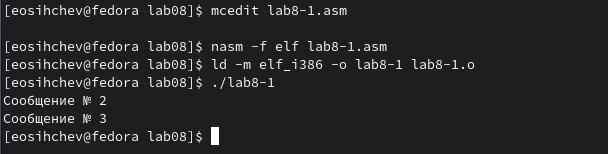
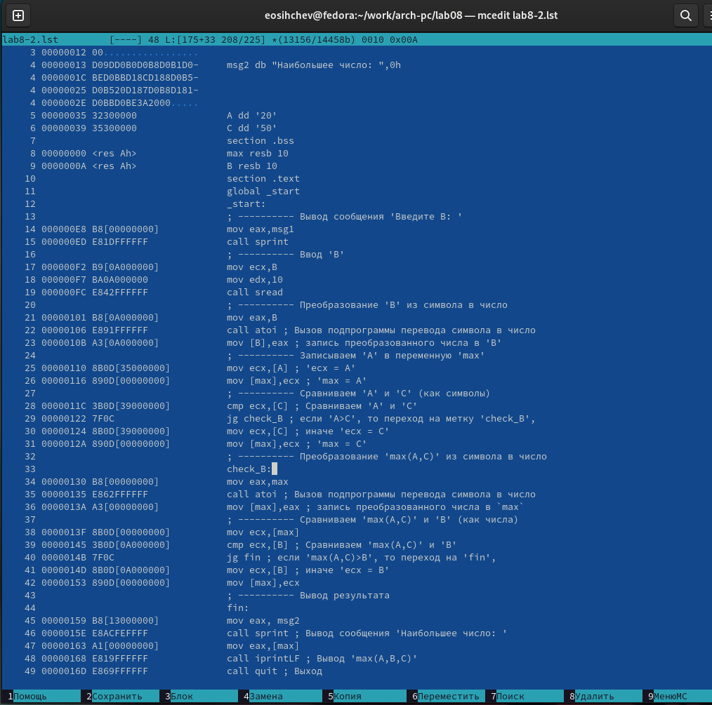
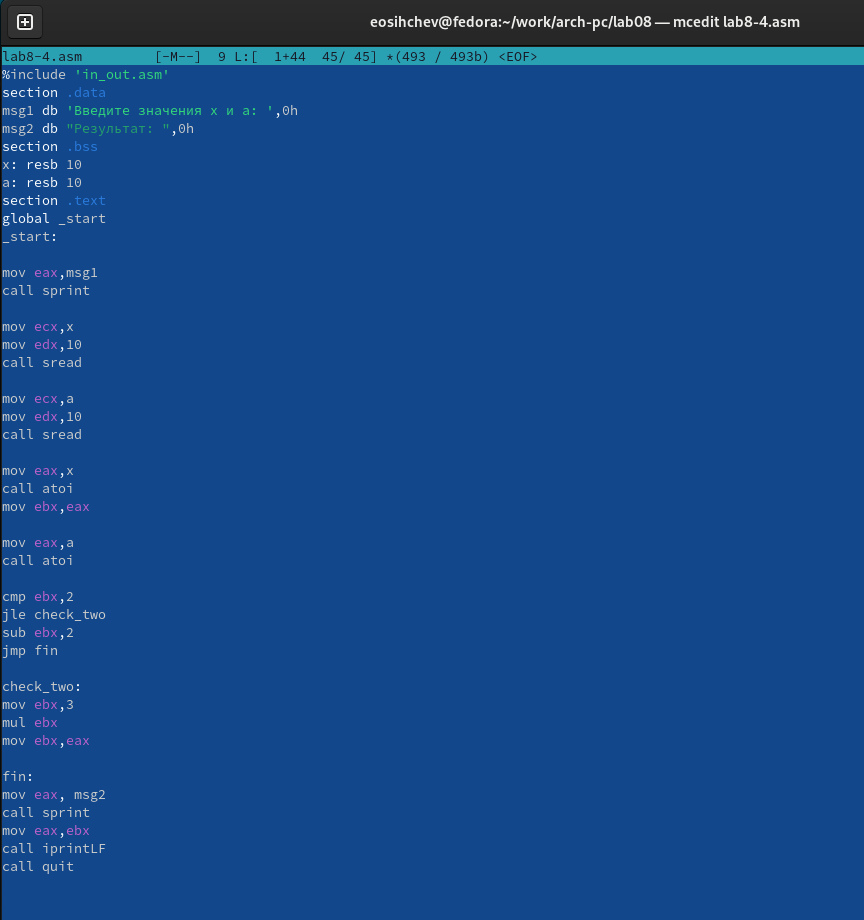

---
## Front matter
title: "Отчёт по лабораторной работе №8"
subtitle: "дисциплина: Архитектура компьютера"
author: "Сычев Егор Олегович"

## Generic otions
lang: ru-RU
toc-title: "Содержание"

## Bibliography
bibliography: bib/cite.bib
csl: pandoc/csl/gost-r-7-0-5-2008-numeric.csl

## Pdf output format
toc: true # Table of contents
toc-depth: 2
lof: true # List of figures
lot: true # List of tables
fontsize: 12pt
linestretch: 1.5
papersize: a4
documentclass: scrreprt
## I18n polyglossia
polyglossia-lang:
  name: russian
  options:
	- spelling=modern
	- babelshorthands=true
polyglossia-otherlangs:
  name: english
## I18n babel
babel-lang: russian
babel-otherlangs: english
## Fonts
mainfont: PT Serif
romanfont: PT Serif
sansfont: PT Sans
monofont: PT Mono
mainfontoptions: Ligatures=TeX
romanfontoptions: Ligatures=TeX
sansfontoptions: Ligatures=TeX,Scale=MatchLowercase
monofontoptions: Scale=MatchLowercase,Scale=0.9
## Biblatex
biblatex: true
biblio-style: "gost-numeric"
biblatexoptions:
  - parentracker=true
  - backend=biber
  - hyperref=auto
  - language=auto
  - autolang=other*
  - citestyle=gost-numeric
## Pandoc-crossref LaTeX customization
figureTitle: "Рис."
tableTitle: "Таблица"
listingTitle: "Листинг"
lofTitle: "Список иллюстраций"
lotTitle: "Список таблиц"
lolTitle: "Листинги"
## Misc options
indent: true
header-includes:
  - \usepackage{indentfirst}
  - \usepackage{float} # keep figures where there are in the text
  - \floatplacement{figure}{H} # keep figures where there are in the text
---

# Цель работы

Изучить команды условного и безусловного переходов. Приобрести навыки написания программ с использованием переходов. Ознакомиться с назначением и структурой файла листинга.

# Выполнение лабораторной работы

1. Создаем каталог для программ лабораторной работы №8 и в нем же создаем файл lab8-1.asm.

2. Вводим в файл lab8-1.asm текст программы из листинга 8.1. Создаем исполняемый файл и запускаем его.

3. Изменяем текст программы в соответсвии с листингом 8.2. Создаем исполняемый файл и запускам его.

4. Изменяем текст программы так, чтобы вывод был в обратном порядке. Создаем исполняемый файл и запускаем его.

5. Создаем файл lab8-2.asm и вводим в него текст программы из листинга 8.3.

6. Создаем исполняемый файл и проверяем его работу для разных значений B.

7. Выполняем трансляцию файла lab8-2.asm с получением файла листинга и открываем его с помощью текстового редактора mcedit.

Разберем строки под номерами 46,48,49:

   - 46 (Номер строки)  00000159 (Адрес)  E8B1FEFFFF (Машинный код)  call sprint ; Вывод сообщения 'Наибольшее число: ' 
   	Инструкция call sprint начинается по смещению 00000159 в сегменте кода. Далее мы можем понять, что инструкция call sprint ассемблируется в машинный код E8B1FEFFFF.
   	
   - 48 (Номер строки)  00000163 (Адрес)  E81EFFFFFF (Машинный код)  call iprintLF ; Вывод 'max(A,B,C)' (Исходный текст программы)
   
      	Инструкция call iprintLF начинается по смещению 00000163 в сегменте кода. Далее мы можем понять, что инструкция call iprintLF ассемблируется в машинный код E81EFFFFFF (в шестнадцатеричном представлении).
   
   - 49 (Номер строки)  00000168 (Адрес)  E86EFFFFFF (Машинный код)  call quit ; Выход (Исходный текст программы)
   
      	Инструкция call quit начинается по смещению 00000168 в сегменте кода. Далее мы можем понять, что инструкция call quit ассемблируется в машинный код E86EFFFFFF (в шестнадцатеричном представлении).
   
8. Открываем файл с программой lab8-2.asm и в любой инструкции с двумя операндами удаляем один операнд. Выполняем трансляцию с получением файла листинга.

При попытке транслирования терминал выдает ошибку.

Как видим, в данном случае создается только файл листинга.

Можем заметить, что в файле листнига после строки, где мы убрали операнд, появляется сообщение об ошибке (такое же как в терминале при попытке оттранслировать текст программы в объектный файл).

# Самостоятельная работа

1. Создаем файл lab8-3.asm и вводим в него текст программы для нахождения наименьшего числа из 41,62,35 (Вариант №10). Создаем исполняемый файл и запускаем его.

2. Создаем файл lab8-4.asm и вводим в него текст программы, которая для введенных с клавиатуры значений x и a вычисляет значение заданной функции f(x). Создаем исполняемый файл и запускаем его.

Функция f(x) и значения x,a для проверки:

# Вывод

Я изучил команды условного и безусловного переходов. Приобрел навыки написания программ с использованием переходов. Ознакомился с назначением и структурой файла листинга.
